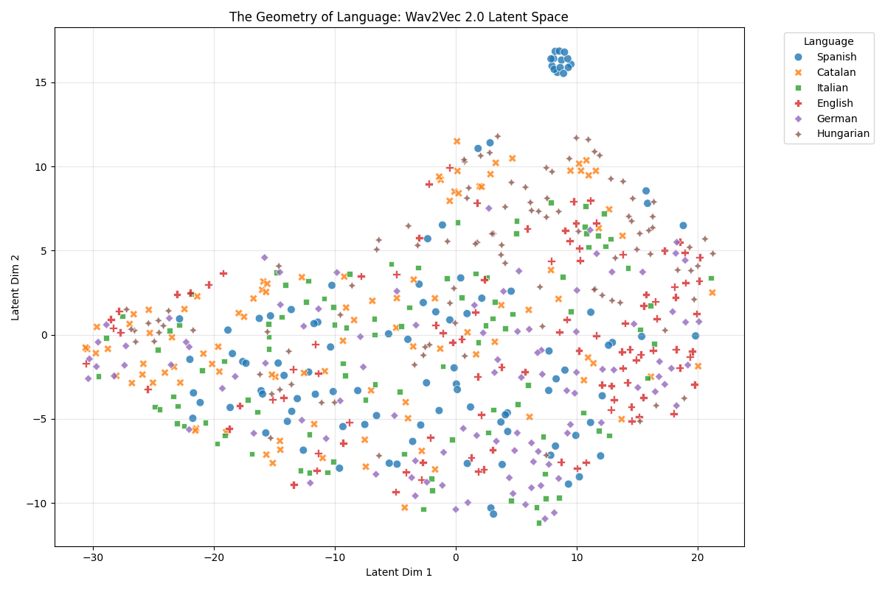

# Acoustic vs. Symbolic: Benchmarking Linguistic Distance in Self-Supervised Audio Embeddings

## 🎯 In One Sentence

This project tests whether neural networks' acoustic understanding of languages matches economists' text-based language distance measures, revealing that while self-supervised models excel at local language discrimination, their global acoustic space doesn't align with traditional symbolic metrics.

---

## 📑 Table of Contents

- [Research Abstract](#-research-abstract)
- [Who Is This For?](#-who-is-this-for)
- [Methodology](#-methodology)
- [Results](#-results)
- [Installation & Usage](#-installation--usage)
- [Repository Structure](#-repository-structure)
- [Limitations](#️-limitations)
- [Future Research Directions](#-future-research-directions)
- [Citation](#-citation)
- [Contributing](#-contributing)
- [License](#-license)

---

## 🔭 Research Abstract

This project bridges the gap between **Labor Economics** and **Audio Deep Learning** by investigating a fundamental question: *Does the "acoustic distance" between languages learned by neural networks correlate with the "symbolic distance" used in economic literature?*

In quantitative economics, migration and labor market integration studies typically rely on text-based proxies (e.g., Levenshtein Distance/ASJP) to quantify the difficulty of learning a new language. This repository implements a computational pipeline to benchmark these traditional metrics against **Latent Acoustic Distance**—a data-driven metric derived from the embedding space of **Meta AI's Wav2Vec 2.0 (XLSR-53)**.

**Research Question**: Can acoustic distance — derived from self-supervised audio embeddings — serve as a better predictor of language learning difficulty in economic models than traditional symbolic distance metrics (Levenshtein/ASJP)?

---

## 👥 Who Is This For?

| Audience | Key Takeaway |
|----------|--------------|
| **Economics Researchers** | Tests if acoustic metrics outperform text-based language distance measures in economic models |
| **Computational Linguists** | Examines how self-supervised models encode language relationships in their latent spaces |
| **ML Engineers** | Provides reproducible pipeline for audio embedding analysis and visualization |
| **Students & Educators** | Example of interdisciplinary ML research with clear methodology and analysis |

---

## 🛠️ Methodology

### Technical Pipeline

The project utilises a modular Python pipeline to transform raw audio into semiotic analysis:

1. **Data Engineering**: Automated ETL pipeline streaming **Google FLEURS** (16kHz) to harvest balanced samples across Romance, Germanic, and Uralic language families
2. **Representation Learning**: Utilisation of **Wav2Vec 2.0 (XLSR-53)** as a feature extractor, processing the model's last hidden states via Mean Pooling
3. **Analysis**: Multidimensional scaling and manifold visualization (t-SNE) combined with Pearson Correlation against ASJP ground truth

### Languages Analyzed

| Language Family | Languages | Samples per Language |
|-----------------|-----------|----------------------|
| **Romance** | Spanish, Italian, Catalan | 100 each |
| **Germanic** | German, Swedish | 100 each |
| **Uralic** | Hungarian | 100 |

**Total Dataset**: 600 audio samples (16kHz, read speech from FLEURS)

---

## 📊 Results

### Key Findings Summary

| Metric | Value |
|--------|-------|
| **Overall Classification Accuracy** | 76% |
| **Catalan Distinctiveness** | 81% accuracy |
| **Hungarian Separability** | 76% from Indo-European |
| **Pearson Correlation** (Acoustic ↔ ASJP) | r ≈ −0.21 (weak) |
| **Dataset Size** | 600 samples (100 per language) |

### Detailed Findings

Using a dataset of **600 audio samples** (N=100 per language), the experiment yielded a significant dissociation between local and global representations:

1. **High Local Separability**:
   - The model achieved **76% accuracy** in distinguishing **Hungarian** (a Uralic isolate) from Indo-European languages
   - **Catalan** showed high distinctiveness (**81% accuracy**), validating its phonological identity despite its lexical proximity to Spanish

2. **The "Romance Continuum"**: As predicted by linguistic theory, the model exhibited high acoustic overlap between **Spanish, Catalan, and Italian**, mirroring the **Dialect Continuum** found in Romance linguistics

3. **Global vs. Local Dissociation**: While local neighborhoods are semantically meaningful (high KNN accuracy), global linear correlations were weak (r ≈ −0.21), suggesting the latent space is **topologically consistent** but **globally anisotropic**

4. **Economic Implications**: The weak correlation challenges the assumption that acoustic similarity aligns with text-based language distance measures used in economic models of migration and labor integration

### Visualizations

#### Language Separation Performance

*Confusion matrix showing model accuracy distinguishing 6 languages. Hungarian and Catalan show highest distinctiveness.*

#### Acoustic Language Space

*t-SNE visualization of audio embeddings showing Romance language continuum and distinct clustering of Hungarian.*

---

## 💻 Installation & Usage

### Quick Start

```bash
# Clone and setup in one go
git clone https://github.com/Ogajah1/acoustic-symbolic-alignment.git
cd acoustic-symbolic-alignment
python -m venv venv && source venv/bin/activate
pip install -r requirements.txt

# Run the complete pipeline
python data_harvester.py && python linguistic_semiotics.py
```

### Prerequisites

- **Python**: 3.9+ (tested with 3.10)
- **RAM**: 8GB minimum (16GB recommended for faster processing)
- **Storage**: ~5GB free disk space for datasets and model cache
- **GPU**: Optional but recommended (analysis runs in ~2 mins vs ~15 mins on CPU)
- **Hugging Face Account**: Required for FLEURS dataset access

### Detailed Installation Steps

**1. Clone the Repository**
```bash
git clone https://github.com/Ogajah1/acoustic-symbolic-alignment.git
cd acoustic-symbolic-alignment
```

**2. Create Virtual Environment** (Recommended)
```bash
# Create and activate virtual environment
python -m venv venv

# On macOS/Linux:
source venv/bin/activate

# On Windows:
venv\Scripts\activate
```

**3. Install Dependencies**
```bash
pip install -r requirements.txt
```

**4. Verify Installation**
```bash
python -c "import torch; import transformers; print('✓ Setup complete')"
```

### Running the Pipeline

**Step A: Harvest Data** (Streaming ingestion from Hugging Face)
```bash
python data_harvester.py
```
*Downloads ~2GB of audio data from FLEURS dataset. First run requires Hugging Face login.*

**Step B: Run Analysis** (Feature extraction and visualization)
```bash
python linguistic_semiotics.py
```

### Expected Output

After running `python linguistic_semiotics.py`, you should see:

1. **Confusion matrix** saved as `Figures/Confusion-Matrix.png`
2. **t-SNE visualization** saved as `Figures/Geometric-landscape.png`
3. **Console output** with correlation metrics:
   ```
   Pearson correlation between acoustic and symbolic distance: -0.21
   KNN classification accuracy: 76.5%
   ```

### Troubleshooting

| Issue | Solution |
|-------|----------|
| **CUDA/GPU errors** | Install CPU-only PyTorch: `pip install torch torchaudio --index-url https://download.pytorch.org/whl/cpu` |
| **Hugging Face download fails** | Login first: `huggingface-cli login` or set token: `export HF_TOKEN=your_token` |
| **Out of memory errors** | Reduce batch size in `linguistic_semiotics.py` (line 47) from 32 to 16 or 8 |
| **Missing dependencies** | Reinstall: `pip install --upgrade -r requirements.txt` |
| **Slow processing** | Check if GPU is being used: `python -c "import torch; print(torch.cuda.is_available())"` |

---

## 📁 Repository Structure

```
acoustic-symbolic-alignment/
├── README.md                  # This file
├── LICENSE                    # MIT License
├── requirements.txt           # Python dependencies
├── .gitignore                 # Git ignore rules
├── data_harvester.py          # Robust N=100 streaming ingestion script
├── linguistic_semiotics.py    # Analysis engine with Anisotropy Correction
└── Figures/                   # Generated visualizations
    ├── Confusion-Matrix.png   # Language classification confusion matrix
    └── Geometric-landscape.png # t-SNE projection of latent space
```

**Key Files:**
- `data_harvester.py`: Downloads and preprocesses audio samples from Google FLEURS dataset
- `linguistic_semiotics.py`: Extracts Wav2Vec2 embeddings, computes acoustic distances, and generates visualizations
- `requirements.txt`: Contains all Python dependencies (PyTorch, Transformers, scikit-learn, etc.)

---

## ⚠️ Limitations

While the confusion matrix demonstrates strong local separability, several constraints frame the interpretation of these results:

1. **Representation Anisotropy**: The weak linear correlation (r ≈ −0.21) between Cosine Distance and Levenshtein Distance indicates that the model's latent space is highly anisotropic (the "Representation Cone" effect). While local neighborhoods are semantically meaningful (high KNN accuracy), global distances are distorted by the common dominant vector of human speech.

2. **Dataset Domain**: This study utilizes **Google FLEURS**, which consists of read speech. The clear articulation in read speech may inflate the model's performance compared to spontaneous, noisy speech found in real-world economic scenarios.

3. **Sample Size**: With N = 600 (100 clips per language), the study is statistically significant for exploratory analysis but effectively a "low-resource" scenario in the context of Deep Learning.

4. **Language Selection Bias**: Focus on European languages (Romance, Germanic, Uralic) limits generalizability to global language diversity, particularly tonal languages (e.g., Mandarin, Thai) or non-Indo-European languages with distinct phonological systems.

---

## 🚀 Future Research Directions

### Short-term Experiments

**1. Layer-Wise Probing of Linguistic Hierarchy**

Investigate the "Depth of Representation" by extracting embeddings from intermediate Transformer layers. The hypothesis is that early layers (1-12) cluster by **phonetic similarity** (acoustic surface form), while deeper layers (24+) cluster by **typological family** (prosodic/syntactic structure).

**2. Disentanglement Analysis (Speaker vs. Language)**

Apply t-SNE visualization colored by `Speaker_ID` rather than `Language_ID` to quantify the model's invariance to speaker identity. This measures the disentanglement of **linguistic content** from **paralinguistic features**.

### Long-term Applications

**3. Applied Economics Research Integration**

Apply the derived "Acoustic Distance" as a novel instrumental variable in applied economics research, testing if acoustic friction predicts labor market integration better than traditional text-based proxies.


**4. Cross-modal Alignment**

Extend to vision-language models to test if similar discrepancies exist between visual sign language representations and their written counterparts.

---

## 📝 Citation

If you find this analysis useful in your research, please cite this repository:

```bibtex
@misc{acoustic-symbolic-alignment,
  author = {Thompson Ogajah, T.},
  title = {Acoustic vs. Symbolic: Benchmarking Linguistic Distance in Self-Supervised Audio Embeddings},
  year = {2026},
  publisher = {GitHub},
  journal = {GitHub repository},
  howpublished = {\url{https://github.com/Ogajah1/acoustic-symbolic-alignment}}
}
```

---

## 🤝 Contributing

Contributions are welcome! Please feel free to submit a Pull Request. For major changes, please open an issue first to discuss what you would like to change.

1. Fork the repository
2. Create a feature branch: `git checkout -b feature/amazing-feature`
3. Commit your changes: `git commit -m 'Add some amazing feature'`
4. Push to the branch: `git push origin feature/amazing-feature`
5. Open a Pull Request

---

## 📄 License

This project is licensed under the MIT License - see the [LICENSE](LICENSE) file for details.

---

## 🙏 Acknowledgments

- **Google FLEURS Team** for providing the multilingual speech dataset
- **Meta AI** for the Wav2Vec 2.0 XLSR-53 pre-trained model
- **Hugging Face** for dataset and model hosting infrastructure

---

*Developed at the intersection of Econometrics and Audio Machine Learning.*  
*For questions or collaborations, please open an issue on GitHub.*
