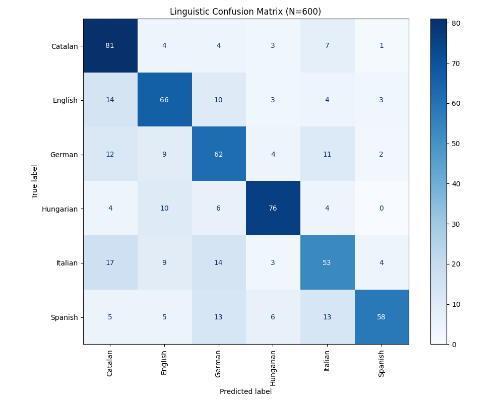

# Acoustic vs. Symbolic: Benchmarking Linguistic Distance in Self-Supervised Audio Embeddings

### 🔭 Research Abstract
This project investigates the alignment between **Symbolic Linguistic Distance** (Levenshtein/ASJP) and **Latent Acoustic Distance** in state-of-the-art audio models. Using **Meta AI’s Wav2Vec 2.0**, I analyzed whether self-supervised models implicitly learn the "Romance-Germanic-Uralic" typological divide without supervision.

### 🔬 Key Findings
Using a dataset of **600 audio samples** (N=100 per language) across 6 languages, the experiment yielded a significant dissociation between local and global representations:

1.  **High Local Separability (The "Isolate" Hypothesis)**:
    * The model achieved **76% accuracy** in distinguishing **Hungarian** (a Uralic isolate) from Indo-European languages using a simple KNN classifier.
    * **Catalan** showed high distinctiveness (**81% accuracy**), validating its phonological identity despite its lexical proximity to Spanish.

2.  **The "Romance Continuum"**:
    * As predicted by linguistic theory, the model exhibited the highest "confusion" between **Spanish, Catalan, and Italian**. This acoustic overlap mirrors the **Dialect Continuum** found in Romance linguistics.

3.  **Manifold Geometry**:
    * While local clusters were distinct (High KNN Accuracy), global linear correlations with Levenshtein distance were weak. This suggests the Wav2Vec 2.0 latent space is **topologically consistent** (neighbors are correct) but **globally anisotropic** (directions are non-linear).

### 🛠️ Technical Pipeline
* **Data**: Automated ETL pipeline streaming **Google FLEURS** (16kHz).
* **Model**: Wav2Vec 2.0 (XLSR-53) Feature Extractor (Layer -1).
* **Metrics**: Dimensionality Reduction (t-SNE), Pearson Correlation, and KNN Classification.

### 📁 Repository Structure
* `data_harvester.py`: Robust N=100 streaming ingestion script.
* `linguistic_semiotics.py`: Analysis engine with Anisotropy Correction.
* `Confusion-Matrix.png`: Visualization of semiotic overlap.
* `Geometric-landscape.png`: t-SNE projection of the latent space.

### ⚠️ Limitations
While the confusion matrix demonstrates strong local separability, several constraints frame the interpretation of these results:

1.  **Representation Anisotropy**: The weak linear correlation ($r \approx -0.21$) between Cosine Distance and Levenshtein Distance indicates that the model's latent space is highly anisotropic (the "Representation Cone" effect). While local neighborhoods are semantically meaningful (high KNN accuracy), global distances are distorted by the common dominant vector of human speech.
2.  **Dataset Domain**: This study utilizes **Google FLEURS**, which consists of read speech. The clear articulation in read speech may inflate the model's performance compared to spontaneous, noisy speech found in real-world economic scenarios.
3.  **Sample Size**: With $N=600$ (100 clips per language), the study is statistically significant for exploratory analysis but effectively a "low-resource" scenario in the context of Deep Learning.

### 🚀 Future Research Directions

**1. Layer-Wise Probing of Linguistic Hierarchy**
Investigate the "Depth of Representation" by extracting embeddings from intermediate Transformer layers. The hypothesis is that early layers (1-12) cluster by **phonetic similarity** (acoustic surface form), while deeper layers (24+) cluster by **typological family** (prosodic/syntactic structure).

**2. Disentanglement Analysis (Speaker vs. Language)**
Apply t-SNE visualization colored by `Speaker_ID` rather than `Language_ID` to quantify the model's invariance to speaker identity. This measures the disentanglement of **linguistic content** from **paralinguistic features**.

**3. Economic Gravity Model Integration**
Utilize the derived "Acoustic Distance" as a novel instrumental variable in **Gravity Models of Trade**, testing if acoustic friction predicts labor market integration better than traditional text-based proxies.
---
*A research study bridging Labor Economics (Linguistic distances, Migration Costs, etc.) and Audio Deep Learning.*