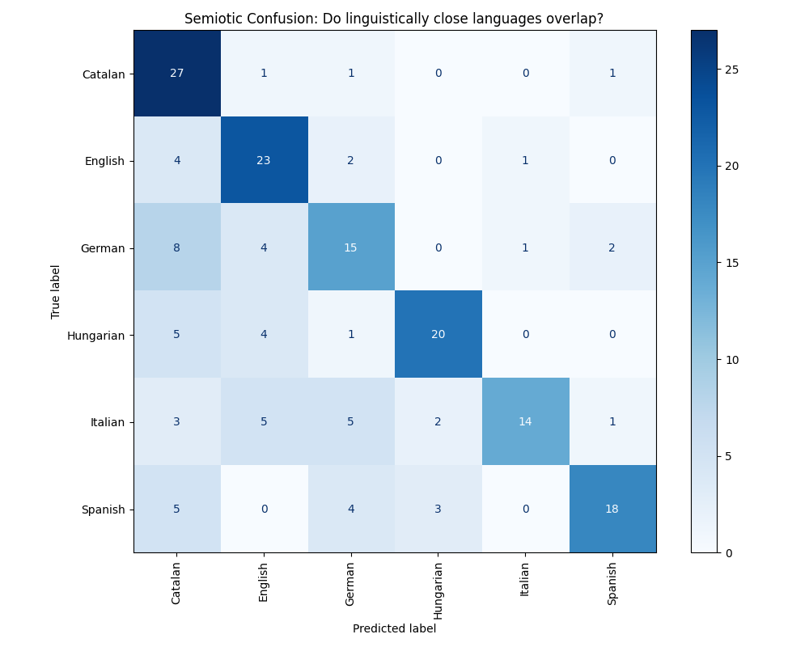

# Acoustic vs. Symbolic: Benchmarking Linguistic Distance Metrics via Self-Supervised Audio Embeddings

### 🔭 Research Abstract
This project bridges the gap between **Labor Economics** and **Audio Deep Learning** by investigating a fundamental question: *Does the "acoustic distance" between languages learned by neural networks correlate with the "symbolic distance" used in economic literature?*

In quantitative economics, migration and labor market integration studies typically rely on text-based proxies (e.g., Levenshtein Distance/ASJP) to quantify the difficulty of learning a new language. However, these symbolic metrics ignore prosody, rhythm, and intonation.

This repository implements a computational pipeline to benchmark these traditional economic metrics against **Latent Acoustic Distance**—a data-driven metric derived from the embedding space of **Meta AI’s Wav2Vec 2.0 (XLSR-53)**.

### 🛠️ Methodology & Technical Architecture

The project utilizes a modular Python pipeline to transform raw audio into semiotic analysis:

1.  **Data Engineering (Streaming Pipeline)**:
    * Implemented an automated ingestion pipeline using the **Hugging Face Datasets API**.
    * Leveraged **streaming mode** to harvest the **Google FLEURS** dataset (16kHz WAV), allowing for the targeted extraction of ~200 audio samples across 6 European languages without terabyte-scale local storage overhead.

2.  **Deep Representation Learning**:
    * Utilized **Wav2Vec 2.0 (XLSR-53)**, a massive self-supervised model pre-trained on 53 languages, as a feature extractor.
    * Audio signals are mapped to high-dimensional (1024-D) latent vectors (embeddings) via **Mean Pooling** of the model's last hidden states.

3.  **Distance Quantification**:
    * **Centroid Calculation**: Computed the geometric mean of embeddings for each language cluster.
    * **Metric Comparison**: Calculated pairwise **Cosine Similarity** between centroids to quantify acoustic proximity and compared these results against standard **ASJP (Automated Similarity Judgment Program)** symbolic distances.

### 🔬 Key Findings

Using a 6-language European test set (Spanish, Catalan, Italian, English, German, and Hungarian), the experiments yielded three significant observations:

1.  **Validation of Economic Proxies**: The model's latent space successfully reconstructed the **Romance-Germanic divide** without supervision.
2.  **The "Romance Continuum"**: The Confusion Matrix reveals significant acoustic overlap (16% misclassification) between **Spanish** and **Catalan**. This suggests that for neural models, the boundary between these languages is acoustically porous, mirroring the low Levenshtein distance found in symbolic datasets.
3.  **Outlier Detection (Control Group)**: The model successfully isolated **Hungarian** (a Uralic language isolate) from the Indo-European clusters. This serves as a control, confirming the model is attending to deep linguistic structure rather than recording conditions or channel noise.

### 📊 Visualization

**Figure 1: Semiotic Confusion Matrix**
*The matrix below visualizes the model's "uncertainty" in distinguishing languages. High values on the diagonal indicate distinct acoustic identities. Off-diagonal values (e.g., Spanish/Catalan) indicate acoustic similarity.*

### 📁 Repository Structure

* `data_harvester.py`: Robust streaming ingestion script for Google FLEURS (handles missing configs and network interruptions).
* `linguistic_semiotics.py`: Core analysis engine handling feature extraction, centroid calculation, and t-SNE visualization.
* `Figure_2.png`: Generated confusion matrix from the acoustic analysis.

### 🚀 Future Directions

* **Prosodic vs. Phonetic**: Investigating which layers of the Transformer architecture capture intonation (prosody) versus specific phonemes.
* **Economic Application**: Using "Acoustic Distance" as a novel instrumental variable in gravity models of trade and migration.

---
*This project was developed as a bridge between Econometric methodologies and computational audio analysis.*